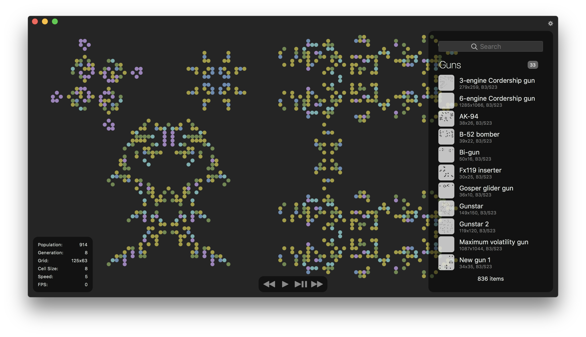

GameOfLife
==========

  

About
-----

Conway's Game of Life macOS app: [www.game-of-life.io](http://www.game-of-life.io/)

License
-------

GameOfLife is released under the terms of the MIT license.

Repository Infos
----------------

    Owner:          Jean-David Gadina - XS-Labs
    Web:            www.xs-labs.com
    Blog:           www.noxeos.com
    Twitter:        @macmade
    GitHub:         github.com/macmade
    LinkedIn:       ch.linkedin.com/in/macmade/
    StackOverflow:  stackoverflow.com/users/182676/macmade
